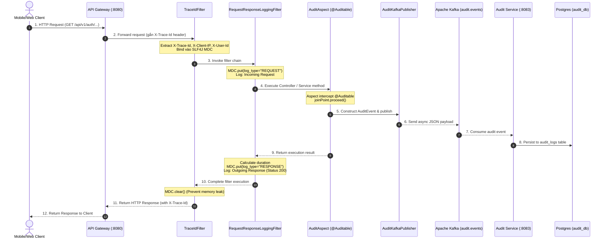

# BiteBolt Request Lifecycle & Logging Execution Flow

Tài liệu này chi tiết luồng xử lý của một HTTP Request đi qua kiến trúc Microservices của BiteBolt, cách dữ liệu Log / Trace / Audit được khởi tạo, truyền tải và lưu trữ, cùng danh sách các Class cốt lõi để các kỹ sư phát triển và AI Agent dễ dàng đặt Breakpoint khi Debug.

---

## 🏛️ 1. Sơ Đồ Trình Tự Thực Thi (Sequence Diagram)

---

## 🔍 2. Chi Tiết Các Bước Xử Lý (End-to-End Execution Flow)

### 📍 Bước 1: API Gateway (Tiếp nhận & Khởi tạo Trace Correlation)
- **Vị trí**: `infrastructure/api-gateway`
- **Nghiệp vụ**:
  - Request đi vào API Gateway tại port `8080`.
  - Gateway kiểm tra header `X-Trace-Id`. Nếu chưa có, Gateway sẽ khởi tạo một chuỗi `UUID` mới (ví dụ: `trace-a1b2c3d4`).
  - Gateway đính kèm `X-Trace-Id`, `X-Client-IP`, `X-User-Id` (sau khi xác thực JWT) vào Header gửi sang Microservice đích.

---

### 📍 Bước 2: Microservice - Nạp MDC Context (`TraceIdFilter`)
- **Vị trí**: `common-libraries/common-logging`
- **Class**: `com.bitebolt.common.logging.filter.TraceIdFilter` (`@Order(Ordered.HIGHEST_PRECEDENCE)`)
- **Nghiệp vụ**:
  1. Trích xuất `X-Trace-Id` từ Request Header và nạp vào SLF4J MDC: `MDC.put("traceId", traceId)`.
  2. Trích xuất Client IP (`X-Client-IP`, `X-Forwarded-For`) và nạp vào MDC: `MDC.put("client_ip", clientIp)`.
  3. Trích xuất User ID (`X-User-Id`) nạp vào MDC: `MDC.put("actor_id", userId)`.
  4. Đính kèm header `X-Trace-Id` vào HTTP Response trả về cho Client.
  5. Trong khối `finally`: Gọi `MDC.clear()` để giải phóng thread pool, chống rò rỉ bộ nhớ.

---

### 📍 Bước 3: HTTP Lifecycle Logging (`RequestResponseLoggingFilter`)
- **Vị trí**: `common-libraries/common-logging`
- **Class**: `com.bitebolt.common.logging.filter.RequestResponseLoggingFilter` (`@Order(Ordered.HIGHEST_PRECEDENCE + 1)`)
- **Nghiệp vụ**:
  1. **Log Đầu Vào (Request)**: Bỏ qua các endpoint `/actuator`, `/swagger`. Nạp `log_type = REQUEST`, `method`, `path` vào MDC và xuất log console: `Incoming Request: GET /api/v1/auth/...`.
  2. Bọc Request/Response bằng `ContentCachingRequestWrapper` / `ContentCachingResponseWrapper` để bảo toàn body payload.
  3. **Log Đầu Ra (Response)** (Khối `finally`): Tính thời gian xử lý `duration_ms` và HTTP Status (200, 400, 500) ➔ Xuất log console: `Outgoing Response: GET ... - Status: 200 - 15ms`.

---

### 📍 Bước 4: Inter-service gRPC & Integration Logging
- **Vị trí**: `common-libraries/common-grpc` & `common-libraries/common-logging`
- **Class**: `GrpcTraceClientInterceptor` & `IntegrationLogger`
- **Nghiệp vụ**:
  - Khi microservice này gọi gRPC sang microservice khác (ví dụ: `auth-service` gọi `user-service`), `GrpcTraceClientInterceptor` tự động lấy `traceId` từ MDC gắn vào gRPC Metadata header.
  - Sử dụng `IntegrationLogger.grpcCall("user-service", "getUserProfile", duration, "OK")` để ghi nhận vết gọi liên dịch vụ.

---

### 📍 Bước 5: Audit Logging Nghiệp Vụ (`AuditAspect` & Kafka Publisher)
- **Vị trí**: `common-libraries/common-logging`
- **Class**: `AuditAspect` & `AuditKafkaPublisher`
- **Nghiệp vụ**:
  1. Đánh chặn các hàm có Annotation `@Auditable(action = ..., resourceType = ..., resourceIdParam = ...)`.
  2. Thực thi hàm bằng `joinPoint.proceed()`. Nếu thành công ➔ `status = "SUCCESS"`. Nếu xảy ra Exception ➔ `status = "FAILURE"`, bắt thông điệp lỗi vào `details`.
  3. Giải mã SpEL `resourceIdParam` lấy giá trị tham số động.
  4. Gom toàn bộ thông tin từ MDC (`traceId`, `actorId`, `actorIp`) + Metadata tạo thành đối tượng `AuditEvent`.
  5. Gọi `AuditKafkaPublisher.publish(event)` đẩy JSON payload sang Kafka topic `audit.events` theo cơ chế bất đồng bộ (Fire-and-Forget).

---

### 📍 Bước 6: Lưu Vết Audit DB & Phân Tích Log Centralized
- **Vị trí**: `core-services/audit-service` & `infrastructure/`
- **Nghiệp vụ**:
  1. Microservice `audit-service` lắng nghe topic `audit.events`, tiêu thụ JSON payload và lưu vào bảng `audit_logs` trong PostgreSQL (`audit_db`).
  2. **Fluent Bit** thu thập console log JSON của các container ➔ Đẩy vào **OpenSearch** (Search log theo `traceId`).
  3. **Grafana Tempo** thu thập OTLP Traces ➔ Trực quan hóa **Waterfall Chart** về độ trễ các service.

---

## 🛠️ 3. Bảng Điểm Đặt Breakpoint Debug Cho Lập Trình Viên

Khi cần debug luồng đi của request hoặc kiểm tra lỗi log/audit, hãy đặt Breakpoint tại các Class và phương thức dưới đây:

| STT | Mục đích Debug | Module / Project | Class Cần Debug | Phương Thức / Line |
|:---:|---|---|---|---|
| **1** | **Xác thực JWT & Routing** | `infrastructure/api-gateway` | `JwtAuthenticationFilter.java` | `filter(...)` |
| **2** | **Kiểm tra nạp Trace ID & MDC** | `common-libraries/common-logging` | `TraceIdFilter.java` | `doFilterInternal(...)` |
| **3** | **Kiểm tra Log HTTP Request / Response** | `common-libraries/common-logging` | `RequestResponseLoggingFilter.java` | `doFilterInternal(...)` |
| **4** | **Kiểm tra gRPC Trace Propagation** | `common-libraries/common-grpc` | `GrpcTraceClientInterceptor.java` | `interceptCall(...)` |
| **5** | **Kiểm tra AOP Audit Aspect & SpEL** | `common-libraries/common-logging` | `AuditAspect.java` | `audit(...)` |
| **6** | **Kiểm tra Đẩy Event sang Kafka** | `common-libraries/common-logging` | `AuditKafkaPublisher.java` | `publish(...)` |
| **7** | **Kiểm tra Nhận Kafka & Lưu DB Audit** | `core-services/audit-service` | `AuditEventConsumer.java` | `consume(...)` |

---

## 📋 4. Các Hằng Số Quản Lý Tập Trung (`AuditConstant`)

Tất cả các hằng số liên quan tới Logging & Audit trong toàn bộ hệ thống BiteBolt BẮT BUỘC phải được tham chiếu từ `AuditConstant.java`:

- **MDC Keys**: `AuditConstant.MDC_KEY_ACTOR_ID` (`actor_id`), `AuditConstant.MDC_KEY_CLIENT_IP` (`client_ip`), `AuditConstant.MDC_KEY_LOG_TYPE` (`log_type`).
- **Log Types**: `AuditConstant.LOG_TYPE_AUDIT` (`AUDIT`), `AuditConstant.LOG_TYPE_REQUEST` (`REQUEST`), `AuditConstant.LOG_TYPE_SECURITY` (`SECURITY`).
- **Statuses**: `AuditConstant.STATUS_SUCCESS` (`SUCCESS`), `AuditConstant.STATUS_FAILURE` (`FAILURE`).
- **Kafka Topics**: `AuditConstant.TOPIC_AUDIT_EVENTS` (`audit.events`).
