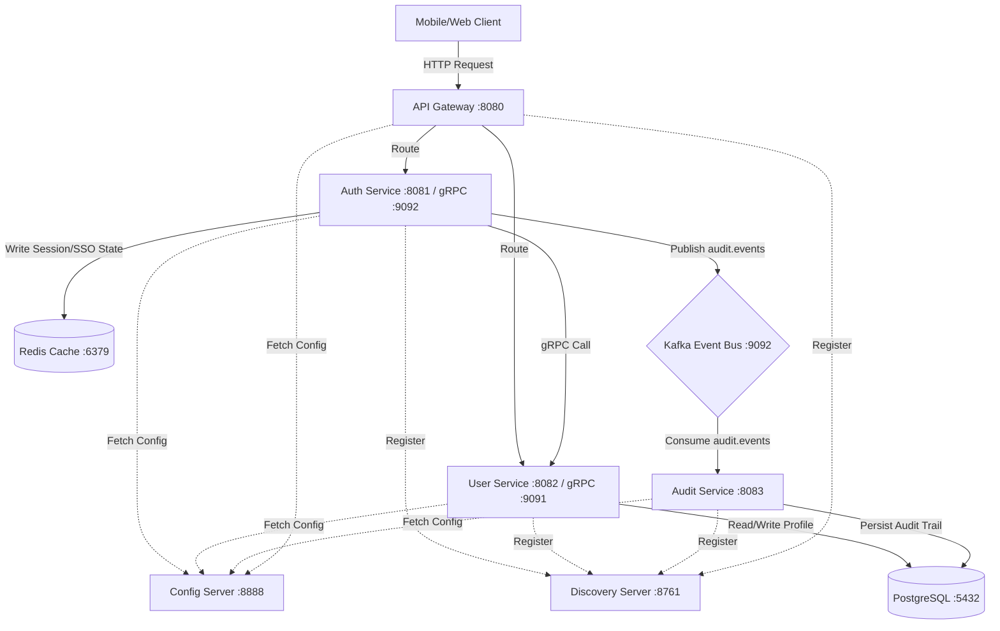
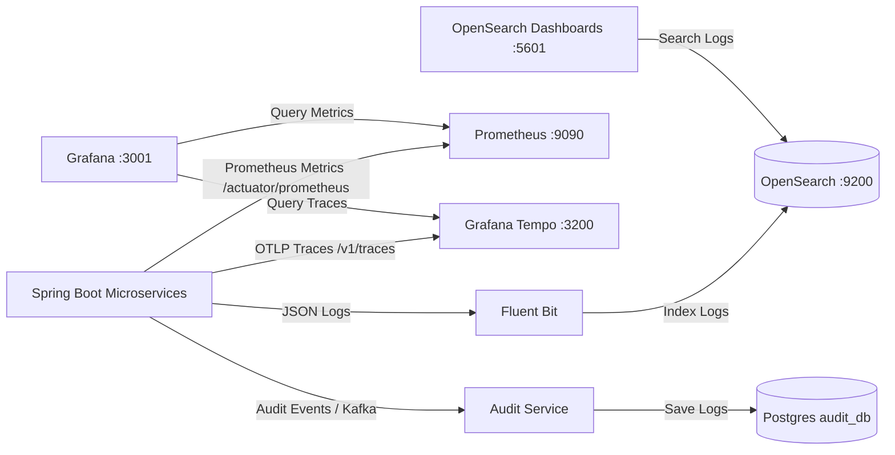

# BiteBolt Backend Platform

[](https://spring.io/projects/spring-boot)
[](https://www.oracle.com/java/technologies/downloads/)
[](https://grpc.io/)
[](https://kafka.apache.org/)
[](https://redis.io/)
[](https://opensearch.org/)
[](https://prometheus.io/)
[](https://grafana.com/)
[](https://grafana.com/oss/tempo/)

BiteBolt is an enterprise-grade, high-performance distributed food ordering platform. This repository contains the backend microservices monorepo structured as a Maven multi-module project.

---

## 🏛️ System Architecture

The platform is designed around **Domain-Driven Design (DDD)**, separating core domains into independent microservices communicating internally via high-performance **gRPC**, using **Apache Kafka** for event-driven message queuing, and protected by a full-stack **Observability Suite** (OpenSearch, Prometheus, Grafana, Tempo, Fluent Bit).



### Module Structure
* **`common-libraries/`**: Shared core packages.
    * `common-dto`: Reusable data transfer objects, base models, API response envelopes, and system constants.
    * `common-validation`: Custom annotation-driven validations (e.g. `@RequireField`).
    * `common-exception`: Global Exception Handling (`GlobalExceptionHandler`) and HTTP exceptions.
    * `common-logging`: Centralized `AuditConstant`, MDC context filters, AOP audit aspect, and structured loggers.
    * `common-grpc`: Centralized gRPC proto files, stub generation settings, and metadata interceptors.
    * `common-security`: Centralized JWT generation/validation (`JwtProvider`) and Cryptography utilities (`CryptoUtils`).
* **`core-services/`**: Business microservices.
    * `auth-service` (Port `8081` / gRPC `9092`): Handles 2FA authentication, Microsoft Entra ID SSO, JWT generation, and Redis session states.
    * `user-service` (Port `8082` / gRPC `9091`): User profile repository, gRPC provider, and REST APIs for User Management CRUD.
    * `audit-service` (Port `8083`): Event consumer for Kafka `audit.events` topic, persisting SOC2/ISO 27001 compliant audit trails into PostgreSQL (`audit_db`).
* **`infrastructure/`**: Centralized infrastructure services and configurations.
    * `api-gateway` (Port `8080`): Spring Cloud Gateway handling centralized routing, JWT validation, Redis Blacklist checking, and standardized CORS.
    * `config-server` (Port `8888`): Centralized Spring Cloud Config server that serves `application.properties` to all microservices based on profiles (`dev`/`prod`).
    * `discovery-server` (Port `8761`): Netflix Eureka Server for dynamic service registration and discovery.
    * `prometheus/`: Centralized Prometheus metric scrape configuration (`prometheus.yml`).
    * `tempo/`: Grafana Tempo distributed tracing configuration (`tempo.yaml`).
    * `fluent-bit/`: Fluent Bit log shipper parser and output configurations (`fluent-bit.conf`).
* **`.agents/`**: IDE instructions and coding style rules for AI development agents.

---

## 🏎️ Message Broker & Caching

### Apache Kafka (Event Streaming)
We use Kafka to decouple domain services and ensure eventual consistency.
* **Topic Naming Convention**: `{domain}.{entity}.{event}` (e.g., `auth.user.created`, `audit.events`).
* **Usage in Auth Service**: When a business action annotated with `@Auditable` is executed, `AuditAspect` publishes an audit event to the `audit.events` topic. `audit-service` consumes these events asynchronously and writes to `audit_db`.
* **Serialization**: Messages are serialized using JSON (`StringSerializer`).

### Redis (High-Performance Caching & State)
Redis is critical for maintaining stateless microservices and handling high-throughput authentication flows.
* **JWT Token Blacklisting**: When a user logs out, their JWT is hashed and stored in Redis with a TTL equal to the remaining expiration time. The API Gateway checks this blacklist before routing requests.
* **Refresh Token Storage**: Long-lived refresh tokens are hashed and securely stored in Redis, allowing the system to instantly revoke access across all devices.
* **SSO State Management**: During Microsoft Entra ID login, an anti-CSRF `state` parameter is generated and temporarily cached in Redis (10-minute TTL) to validate the Microsoft callback.

---

## 🔐 Authentication & Security Flow

BiteBolt enforces strict Role-Based Access Control (RBAC).

### Roles & Login Strategies
| Role | Strategy | Details |
|---|---|---|
| **ADMIN / STAFF** | SSO (Microsoft Entra ID) | Internal enterprise users log in exclusively via corporate SSO. |
| **SHIPPER / CUSTOMER** | Phone OTP / Google | End-users log in via 6-digit SMS OTP or Social Login. |

### Token Management & Blacklist
- **Dual Token Architecture**: Upon successful authentication, the system issues a short-lived `access_token` (JWT) and a long-lived `refresh_token`.
- **Client Adaptive Responses**:
    - If `Client-Type: web` header is provided, tokens are securely set as `HttpOnly` cookies.
    - If omitted or set to `mobile` (default), tokens are returned in the JSON response body to be consumed via `Authorization: Bearer`.

---

## 🚀 Getting Started

### 1. Environment Variables Setup
Copy the development environment template and create your active `.env.dev` file at the root of the project:
```bash
# Ensure .env.dev contains ENTRA_CLIENT_ID, POSTGRES credentials, etc.
# Note: The system natively loads .env.dev via custom EnvLoaderEnvironmentPostProcessor.
```

### 2. Spin Up Infrastructure Dependencies
Start Postgres, Redis, Kafka, OpenSearch, Prometheus, Grafana, Tempo, and Fluent Bit using Docker Compose:
```bash
cd infrastructure
docker-compose -f docker-compose.dev.yml up -d
```
*Note: Postgres is configured with `init-db.sql` to automatically initialize `auth_db` and `audit_db`.*

### 3. Compile Shared Libraries
Before running any microservice, install the gRPC and common libraries to your local Maven repository:
```bash
cd common-libraries
mvn clean install
```

### 4. Start the Microservices
The services **must** be started in the following order to ensure configuration and discovery works properly:

1. **Discovery Server (Eureka)** (Port `8761`)
2. **Config Server** (Port `8888`) - *Wait for this to fully start so other services can fetch their config.*
3. **API Gateway** (Port `8080`)
4. **Auth Service** (Port `8081` / gRPC `9092`)
5. **User Service** (Port `8082` / gRPC `9091`)
6. **Audit Service** (Port `8083`)

*Run each service via your IDE (IntelliJ/VSCode) or CLI:*
```bash
cd infrastructure/discovery-server
mvn spring-boot:run -Dspring-boot.run.profiles=dev
```

---

## 🪵 Tracing, Logging Standards & Observability

BiteBolt implements an **Enterprise-grade Full-Stack Observability** architecture built around 3 core pillars: **Logs** (OpenSearch / Fluent Bit), **Metrics** (Prometheus / Grafana), and **Traces** (Tempo / OpenTelemetry).



---

### 1. Centralized Tracing & Logging Architecture
1. **Trace Correlation**: Every HTTP request originating from API Gateway generates or propagates an **`X-Trace-Id`** header. The `TraceIdFilter` binds this ID into the SLF4J MDC context (`traceId`, `actor_id`, `client_ip`).
2. **gRPC Context Propagation**: `GrpcTraceClientInterceptor` automatically forwards trace metadata across gRPC network calls between microservices.
3. **Log Centralization & Masking**: The `logback-spring.xml` configuration structures logs in JSON format with dynamic `service` resolution from `spring.application.name`. Sensitive PII data is automatically masked using `MaskingUtil`.
4. **Audit Logging (SOC2 / ISO 27001 / PCI-DSS Enterprise Standard)**:
   - Uses the `@Auditable(action = ..., resourceType = ..., resourceIdParam = ...)` annotation.
   - The `AuditAspect` interceptor records execution outcomes (`SUCCESS`/`FAILURE`) and publishes asynchronous events to the Kafka `audit.events` topic.
   - `audit-service` consumes these events and persists them into PostgreSQL (`audit_db.audit_logs`) following **Append-Only** principles.
   - Exposes REST Query API `GET /api/v1/audit/events` for Admin Portal searching, filtering (by `traceId`, `actorId`, `action`, `status`, date range) and pagination.
   - All string literals (`AUDIT`, `SUCCESS`, `FAILURE`, `actor_id`, `client_ip`, `audit.events`) are strictly centralized in `AuditConstant.java`.
   - Detailed documentation: Refer to [.agents/docs/observability/audit-query-api-and-storage.md](.agents/docs/observability/audit-query-api-and-storage.md).

---

### 2. Full Observability Stack Specifications

| Service | Port | Description | URL / Dashboard |
|---|---|---|---|
| **Prometheus** | `9090` | Scrapes metric indicators from `/actuator/prometheus` | `http://localhost:9090` |
| **Grafana** | `3001` | Visualization dashboard for Metrics & Distributed Traces | `http://localhost:3001` (admin/admin) |
| **Tempo** | `3200` / `4318` | Ingests and queries OTLP Distributed Traces | `http://localhost:3200` |
| **OpenSearch** | `9200` | Distributed Log Analytics and Search Engine | `http://localhost:9200` |
| **OpenSearch Dashboards** | `5601` | Web UI for centralized log searching & analytics | `http://localhost:5601` |
| **Fluent Bit** | `24224` | Log shipper forwarding Docker container logs to OpenSearch | N/A |

---

### 3. 🧪 Observability & Audit Verification Guide

#### 🅰️ Verifying Prometheus Metrics in Grafana
1. Start the infrastructure containers:
   ```bash
   cd infrastructure
   docker-compose -f docker-compose.dev.yml up -d
   ```
2. Open Grafana ([http://localhost:3001](http://localhost:3001)) ➔ **Connections** ➔ **Data sources** ➔ Click **Add data source** ➔ Select **Prometheus**.
3. Set Prometheus Server URL to `http://prometheus:9090` ➔ Click **Save & test** (Confirm `"Successfully queried the Prometheus API"` message).
4. Navigate to **Explore** (magnifying glass icon) and execute sample PromQL queries:
   - `up` : Verifies all microservice target endpoints are active (`1` = UP).
   - `jvm_memory_used_bytes` : Monitors JVM heap/non-heap RAM consumption.
   - `http_server_requests_seconds_count` : Tracks HTTP request throughput per endpoint.

---

#### 🅱️ Verifying Grafana Tempo (Distributed Tracing - Waterfall View)
1. In Grafana ➔ **Data sources** ➔ Click **Add data source** ➔ Select **Tempo**.
2. Set URL to `http://tempo:3200` ➔ Click **Save & test** (Confirm `"Data source is working"` message).
3. Trigger a test API request with a custom trace header:
   ```bash
   curl -i -X GET "http://localhost:8081/api/v1/auth/sso/entra/callback?code=mock-code&state=mock-state" \
        -H "X-Trace-Id: bitebolt-tempo-demo-999"
   ```
4. In Grafana ➔ **Explore** ➔ Select **Tempo** as data source ➔ Input Trace ID `bitebolt-tempo-demo-999` ➔ Click **Run query**.
5. **Expected Result**: Grafana renders a detailed **Waterfall Chart** displaying latency across microservices: `auth-service` ➔ `gRPC` ➔ `user-service` ➔ `Redis` ➔ `Kafka`.

---

#### 🅲 Verifying Audit Logging (Enterprise Compliance Audit Trail)
1. Perform a business action (e.g., SSO Login or User Creation).
2. Query the audit database table in PostgreSQL (`audit_db`):
   ```sql
   SELECT * FROM audit_logs ORDER BY created_at DESC;
   ```
3. Validate compliance against the 5 Enterprise Audit Pillars:
   - **WHO**: `actor_id` (User ID), `actor_ip` (Client IP).
   - **WHAT**: `action` (`SSO_LOGIN_SUCCESS`), `resource_type` (`Credential`), `resource_id` (`admin@bitebolt.com`).
   - **WHEN**: `created_at` (ISO-8601 UTC Instant).
   - **WHERE**: `service` (`auth-service`), `trace_id` (Correlation ID across boundaries).
   - **OUTCOME**: `status` (`SUCCESS`/`FAILURE`), `details` (Captured error details).

---

## 📐 Coding Guidelines (For Developers & AI Agents)
Please refer to **[.agents/AGENTS.md](file:///d:/workspace/BiteBolt/bitebolt-backend/.agents/AGENTS.md)** for our strict enterprise coding rules:
- **Global Message Codes** are declared in `common-dto` (`MessageConstant`).
- **Domain-Specific Message Codes** are declared locally inside each service (e.g., `AuthMessageConstant`).
- **Audit Constants**: All MDC field names, log types, topics, and statuses MUST use `AuditConstant`.
- **Environment Loading**: Use `EnvLoaderEnvironmentPostProcessor` for native `.env.dev` loading across all Spring Boot contexts.
