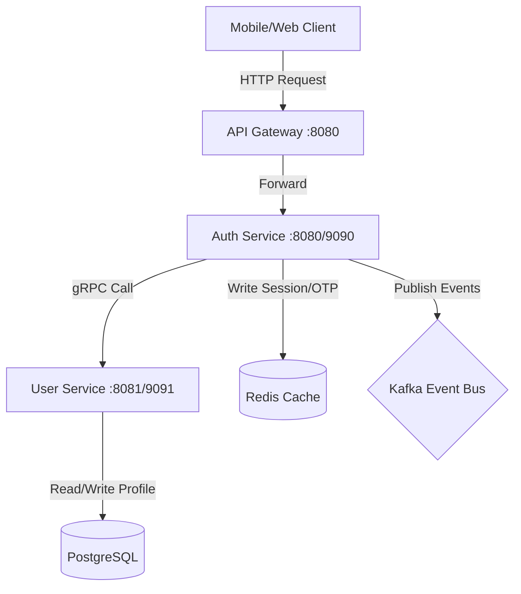

# EcoMove Backend Platform

[](https://spring.io/projects/spring-boot)
[](https://www.oracle.com/java/technologies/downloads/)
[](https://grpc.io/)
[](https://kafka.apache.org/)

EcoMove is an enterprise-grade, high-performance distributed mobility and green transport platform. This repository contains the backend microservices monorepo structured as a Maven multi-module project.

---

## 🏛️ System Architecture

The platform is designed around **Domain-Driven Design (DDD)**, separating core domains into independent microservices communicating internally via high-performance **gRPC** and using **Apache Kafka** for event-driven message queuing.



### Module Structure
* **`common-libraries/`**: Shared core packages.
  * `common-dto`: Reusable data transfer objects, base models, API response envelopes, and system constants.
  * `common-validation`: Custom annotation-driven validations (e.g. `@RequireField`).
  * `common-exception`: Global Exception Handling (`GlobalExceptionHandler`) and HTTP exceptions.
  * `common-logging`: Request logging interceptors and trace correlation utilities.
  * `common-grpc`: Centralized gRPC proto files, stub generation settings, and metadata interceptors.
* **`core-services/`**: Business microservices.
  * `auth-service`: Handle 2FA authentication, phone/password login, JWT generation, and Redis session states.
  * `user-service`: User profile repository and gRPC provider.
* **`infrastructure/`**: Local deployment files, database seed scripts, and Docker compose files.
* **`.agents/`**: IDE instructions and coding style rules for AI development agents.

---

## 🛠️ Tech Stack & Prerequisites
- **Language**: Java 21
- **Framework**: Spring Boot 3.4.2 (Spring Cloud OpenFeign, Spring Security, Spring Data JPA)
- **Communications**: gRPC (protobuf-maven-plugin)
- **Streaming & Cache**: Apache Kafka, Redis (Spring Data Redis)
- **Database**: PostgreSQL (Flyway migration tool)
- **Containerization**: Docker Compose / Kubernetes

---

## 🚀 Getting Started

### 1. Clone & Set Up Local Infrastructure
Spin up the required local instances of Zookeeper, Apache Kafka, PostgreSQL, and Redis:
```bash
cd infrastructure
docker-compose up -d
```

### 2. Compile and Build Shared Libraries
Before running any microservice, you must compile and install the shared library packages to your local Maven repository:
```bash
cd common-libraries
mvn clean install
```

### 3. Running Microservices
Run the microservices using your IDE or via command line:

#### Run User Service:
```bash
cd core-services/user-service
../../mvnw spring-boot:run
```

#### Run Auth Service:
```bash
cd core-services/auth-service
../../mvnw spring-boot:run
```

---

## 🪵 Tracing & Logging Standards

EcoMove uses a centralized distributed tracing design to trace requests across services:
1. Every client request generates or forwards an **`X-Trace-Id`** correlation header.
2. The `TraceIdInterceptor` binds this ID to the local SLF4J MDC (`traceId`).
3. When calling internal services, `GrpcTraceClientInterceptor` automatically propagates the metadata across the network.
4. The destination service extracts the trace ID and registers it locally, allowing complete, trace-correlated log streaming across all microservice boundaries.

---

## 📐 Coding Guidelines (For Developers & AI Agents)
Please refer to **[.agents/AGENTS.md](file:///d:/workspace/EcoMove/eco-move-backend/.agents/AGENTS.md)** for our strict enterprise coding rules:
- **Global Message Codes** (e.g., `ERROR_REQUIRED_FIELD`) are declared in `common-dto` (`MessageConstant`).
- **Domain-Specific Message Codes** (e.g., `ERROR_OTP_EXPIRED`) are declared locally inside each service (e.g., `AuthMessageConstant`).
- **Tracing Keys** are centralized globally in `AppConstant.java` while internal implementation variables (e.g. Redis key prefixes) are encapsulated locally.
