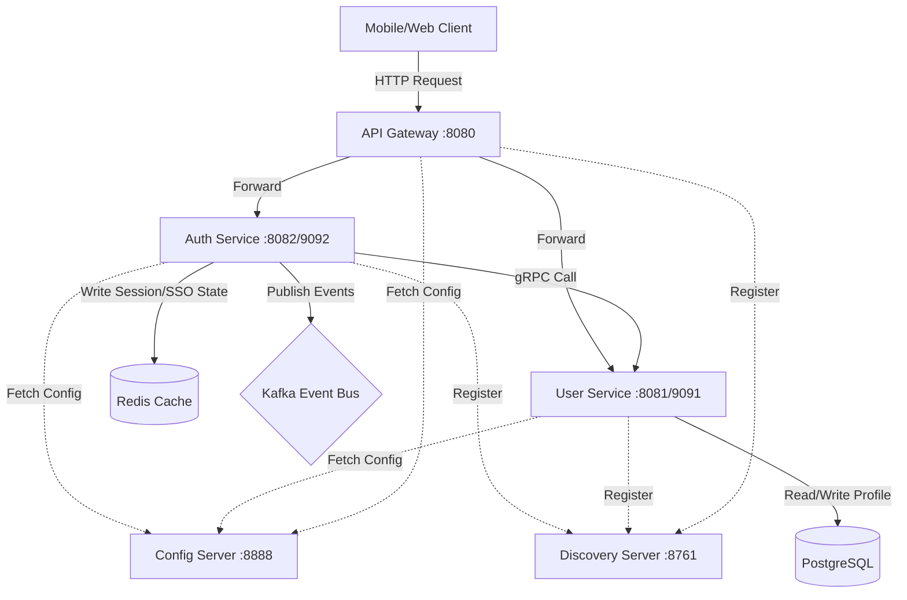

# BiteBolt Backend Platform

[](https://spring.io/projects/spring-boot)
[](https://www.oracle.com/java/technologies/downloads/)
[](https://grpc.io/)
[](https://kafka.apache.org/)
[](https://redis.io/)

BiteBolt is an enterprise-grade, high-performance distributed food ordering platform. This repository contains the backend microservices monorepo structured as a Maven multi-module project.

---

## 🏛️ System Architecture

The platform is designed around **Domain-Driven Design (DDD)**, separating core domains into independent microservices communicating internally via high-performance **gRPC** and using **Apache Kafka** for event-driven message queuing.



### Module Structure
* **`common-libraries/`**: Shared core packages.
    * `common-dto`: Reusable data transfer objects, base models, API response envelopes, and system constants.
    * `common-validation`: Custom annotation-driven validations (e.g. `@RequireField`).
    * `common-exception`: Global Exception Handling (`GlobalExceptionHandler`) and HTTP exceptions.
    * `common-logging`: Request logging interceptors and trace correlation utilities.
    * `common-grpc`: Centralized gRPC proto files, stub generation settings, and metadata interceptors.
    * `common-security`: Centralized JWT generation/validation (JwtProvider) and Cryptography utilities (CryptoUtils).
* **`core-services/`**: Business microservices.
    * `auth-service`: Handle 2FA authentication, Microsoft Entra ID SSO, JWT generation, and Redis session states.
    * `user-service`: User profile repository, gRPC provider, and REST APIs for User Management CRUD.
* **`infrastructure/`**: Centralized infrastructure services and configurations.
    * `api-gateway`: Spring Cloud Gateway handling centralized routing, JWT validation, Redis Blacklist checking, and standardized CORS.
    * `config-server`: Centralized Spring Cloud Config server that serves `application.properties` to all microservices based on profiles (`dev`/`prod`).
    * `discovery-server`: Netflix Eureka Server for dynamic service registration and discovery.
* **`.agents/`**: IDE instructions and coding style rules for AI development agents.

---

## 🏎️ Message Broker & Caching

### Apache Kafka (Event Streaming)
We use Kafka to decouple domain services and ensure eventual consistency.
* **Topic Naming Convention**: `{domain}.{entity}.{event}` (e.g., `auth.user.created`).
* **Usage in Auth Service**: When a new user logs in via SSO, `auth-service` publishes a User Created event to Kafka. Other services (like Notification or Analytics) can consume this event asynchronously without blocking the login flow.
* **Serialization**: Messages are serialized using JSON (`StringSerializer`).

### Redis (High-Performance Caching & State)
Redis is critical for maintaining stateless microservices and handling high-throughput authentication flows.
* **JWT Token Blacklisting**: When a user logs out, their JWT is hashed and stored in Redis with a TTL equal to the remaining expiration time. The API Gateway checks this blacklist before routing requests.
* **Refresh Token Storage**: Long-lived refresh tokens are hashed and securely stored in Redis, allowing the system to instantly revoke access across all devices.
* **SSO State Management**: During Microsoft Entra ID login, an anti-CSRF `state` parameter is generated and temporarily cached in Redis (10-minute TTL) to validate the Microsoft callback.

---

## 🔐 Authentication & Security Flow

BiteBolt enforces strict Role-Based Access Control (RBAC).

### Roles & Login Strategies
| Role | Strategy | Details |
|---|---|---|
| **ADMIN / STAFF** | SSO (Microsoft Entra ID) | Internal enterprise users log in exclusively via corporate SSO. |
| **SHIPPER / CUSTOMER** | Phone OTP / Google | End-users log in via 6-digit SMS OTP or Social Login. |

### Token Management & Blacklist
- **Dual Token Architecture**: Upon successful authentication, the system issues a short-lived `access_token` (JWT) and a long-lived `refresh_token`.
- **Client Adaptive Responses**:
    - If `Client-Type: web` header is provided, tokens are securely set as `HttpOnly` cookies.
    - If omitted or set to `mobile` (default), tokens are returned in the JSON response body to be consumed via `Authorization: Bearer`.

---

## 🚀 Getting Started

### 1. Environment Variables Setup
Copy the development environment template and create your active `.env.dev` file at the root of the project:
```bash
# Rename the dev template to .env.dev (ensure it contains ENTRA_CLIENT_ID, POSTGRES credentials, etc.)
# Note: The system natively loads .env.dev via custom EnvironmentPostProcessor or spring.config.import.
```

### 2. Spin Up Infrastructure Dependencies
Start Postgres, Redis, and Kafka using Docker Compose:
```bash
cd infrastructure
docker-compose -f docker-compose.dev.yml up -d
```
*Note: Postgres is configured with `init-db.sql` to automatically create `user_db` and `auth_db`.*

### 3. Compile Shared Libraries
Before running any microservice, install the gRPC and common libraries to your local Maven repository:
```bash
cd common-libraries
./mvnw clean install
```
*(If you are on Windows, use `mvnw.cmd`)*

### 4. Start the Microservices
The services **must** be started in the following order to ensure configuration and discovery works properly:

1. **Discovery Server (Eureka)** (Port `8761`)
2. **Config Server** (Port `8888`) - *Wait for this to fully start so other services can fetch their config.*
3. **API Gateway** (Port `8080`)
4. **User Service** (Port `8081` / gRPC `9091`)
5. **Auth Service** (Port `8082` / gRPC `9092`)

*Run each service via your IDE (IntelliJ/VSCode) or CLI:*
```bash
cd infrastructure/discovery-server
../../mvnw spring-boot:run -Dspring-boot.run.profiles=dev
```

---

## 🪵 Tracing & Logging Standards

BiteBolt uses a centralized distributed tracing design to trace requests across services:
1. Every client request generates or forwards an **`X-Trace-Id`** correlation header via API Gateway.
2. The `TraceIdFilter` binds this ID to the local SLF4J MDC (`traceId`, `actor_id`, `client_ip`).
3. When calling internal services, `GrpcTraceClientInterceptor` automatically propagates the metadata across the network.
4. The destination service extracts the trace ID, allowing complete, trace-correlated log streaming across all microservice boundaries.

### Log Categories
BiteBolt enforces strict logging categorization for observability:
- **Audit Logs** (`@Auditable`): Critical business state changes (emitted to Kafka -> `audit-service`).
- **Security Logs** (`SecurityLogger`): Authentication, authorization, and security events.
- **Integration Logs** (`IntegrationLogger`): External API boundaries (3rd party services).
- **Performance Logs** (`PerformanceLogger`): Method execution time monitoring.
- **Request/Response Logs**: Automated HTTP lifecycle logging via `RequestResponseLoggingFilter`.

All logs are formatted in JSON using `logstash-logback-encoder` and sensitive data is masked using `MaskingUtil`.

---

## 📐 Coding Guidelines (For Developers & AI Agents)
Please refer to **[.agents/AGENTS.md](file:///d:/workspace/BiteBolt/bitebolt-backend/.agents/AGENTS.md)** for our strict enterprise coding rules:
- **Global Message Codes** are declared in `common-dto` (`MessageConstant`).
- **Domain-Specific Message Codes** are declared locally inside each service (e.g., `AuthMessageConstant`).
- **Environment Loading**: Use `EnvLoaderEnvironmentPostProcessor` for native `.env.dev` loading across all Spring Boot contexts.
